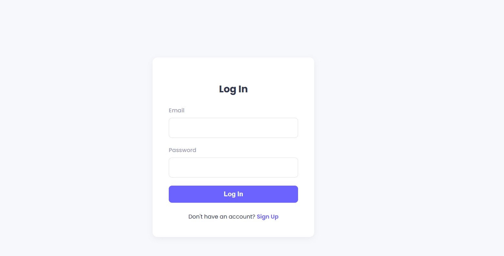

# 🗂️ Task Management Website

A secure, full-stack task management web app with login/signup, JWT auth, MongoDB backend, and a clean React-Redux frontend UI.

---

## 🌐 Live Links

- 🌍 **Frontend**: [https://taskmanagementsarthak.netlify.app](https://taskmanagementsarthak.netlify.app)
- ⚙️ **Backend**: [https://task-management-website-backend.onrender.com](https://task-management-website-backend.onrender.com)

---

## 📸 Screenshots

> Add these images to your `screenshots/` folder inside the repo.

### 🔐 Login Page  


### 🧾 Sign Up Page  


### 📋 Task Assignment UI  


### ✏️ Edit Task Modal  


---

## 📁 Project Structure

```
Task-Management-Website/
├── backend/              # Express + MongoDB + JWT auth
├── frontend/             # React + Redux + Tailwind CSS
├── screenshots/          # UI screenshots for README
└── README.md             # Project documentation
```

---

## ✨ Features

### ✅ Frontend
- JWT login/signup flow
- Create, edit, and delete tasks
- Filter by status and priority
- Mark tasks complete with timestamp
- Responsive, clean UI (TailwindCSS)
- Redux for global state

### 🛠️ Backend
- Node.js + Express REST API
- MongoDB database with Mongoose
- Auth via JWT tokens
- Routes protected with middleware
- CRUD operations for tasks

---

## ⚙️ Getting Started (Local)

### 🔹 Clone the repository

```bash
git clone https://github.com/sarthakmehra02/Task-Management-Website.git
cd Task-Management-Website
```

### 🔹 Install dependencies

```bash
cd frontend && npm install
cd ../backend && npm install
```

### 🔹 Configure `.env` in backend

```
MONGODB_URI=your_mongo_uri
JWT_SECRET=your_jwt_secret
```

---

## 📌 Future Features

- [ ] Drag and drop tasks
- [ ] CSV export
- [ ] Profile pics
- [ ] Push notifications
- [ ] Dark mode switch

---

## 👨‍💻 Author

**Sarthak Mehra**  
GitHub: [@sarthakmehra02](https://github.com/sarthakmehra02)

---

## 🪪 License

MIT License
