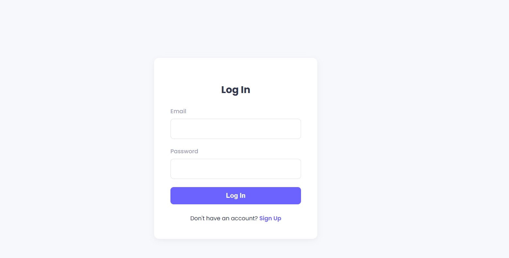

# 🗂️ Task Management Website

A secure, full-stack task management web app built with a modern React + Redux frontend and a Node.js + Express backend. Includes JWT-based authentication, MongoDB database integration, full task editing, filtering, and priority control in a clean, responsive UI.

---

## 🌐 Live Links

- 🚀 **Frontend Website**: [https://taskmanagementsarthak.netlify.app](https://taskmanagementsarthak.netlify.app)
- ⚙️ **Backend API**: [https://task-management-website-backend.onrender.com](https://task-management-website-backend.onrender.com)

---

## 📸 Screenshots

> ✨ Add your screenshots in this section by placing them inside a `screenshots/` folder and using the syntax below:

```



```

---

## 📁 Project Structure

- `frontend/` – React + Redux Toolkit app (UI, auth, task logic)
- `backend/` – Node.js + Express + MongoDB API
- `README.md` – Project documentation (this file)

---

## ✨ Features

### 🔹 Frontend
- User login and signup with JWT authentication
- Add, delete, and **edit** tasks
- Set task **priority**, **due date**, and **status**
- Mark tasks as complete with timestamp
- Filter by **status** and **priority**
- Fully responsive design with Tailwind CSS
- State management using Redux Toolkit

### 🔹 Backend
- Node.js + Express REST API
- MongoDB with Mongoose for persistent storage
- User registration and login with **JWT**
- Protected routes for task operations
- Task schema includes: title, description, status, priority, date, completedAt

---

## 🚀 Getting Started (Local Setup)

### 1. Clone the Repository

```bash
git clone https://github.com/sarthakmehra02/Task-Management-Website.git
cd Task-Management-Website
```

---

### 2. Run the Frontend

```bash
cd frontend
npm install
npm run dev
```

---

### 3. Run the Backend

Open another terminal:

```bash
cd backend
npm install
npm start
```

> ⚠️ Make sure to configure your `.env` file in the `backend/` directory with your MongoDB URI and JWT secret:

```
MONGODB_URI=your_mongo_connection_string
JWT_SECRET=your_jwt_secret
```

---

## 🧩 Future Improvements

- [ ] Add user avatars
- [ ] Export tasks (CSV, PDF)
- [ ] Push notifications / reminders
- [ ] Drag-and-drop task reordering
- [ ] Dark mode toggle

---

## 🤝 Contributing

1. Fork this repository
2. Create a branch: `git checkout -b feature/my-feature`
3. Commit your changes: `git commit -m "Add feature"`
4. Push to GitHub: `git push origin feature/my-feature`
5. Open a Pull Request

---

## 📄 License

This project is licensed under the MIT License.

---

## 🙋 Author

**Sarthak Mehra**  
GitHub: [@sarthakmehra02](https://github.com/sarthakmehra02)
